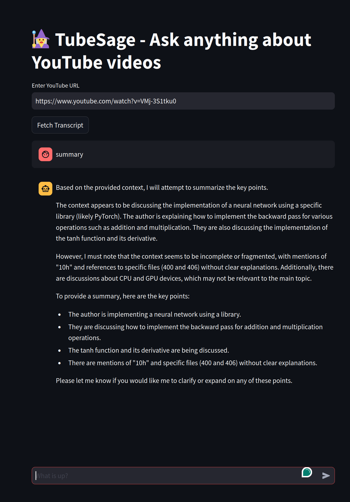

# 🧙‍♂️ TubeSage

LLM based app that understands youtube videos and answer questions about it.

## Project Architecture Overview


1. **YouTube Video Transcription Tool**: Converts video content into text.
2. **Text Embedding**: Uses Ollama server with Llama3.1 to embbed the video transcription.
3. **Vector Storage**: Stores the embedded vectors in Chroma vector database.
4. **Q&A System**: Uses lang chain with a custom prompt and RAG injection from the Chroma db to answer questions about the video.
5. **Web Interface**: Streamlit chat UI.
6. **Deployment**: All three parts (TubeSage api, Ollama server for the LLM and Streamlit UI) are dockerized and can be run with docker compose. For deployment use the specific dockerfiles.


## Getting Started

To get started with TubeSage, follow these steps:

### Prerequisites
- **NVIDIA GPU**: NVIDIA for LLM inference in ollama


- **Docker & Docker Compose**: Ensure Docker and Docker Compose are installed on your system.

### Setup

1. **Clone the Repository**

   ```bash
   git clone https://github.com/yourusername/tubesage.git
   cd tubesage
   ```

2. **Install Dependencies**

   Ensure you have the NVIDIA toolkit installed for CUDA support. 
   - **NVIDIA Toolkit**:  [NVIDIA website](https://docs.nvidia.com/datacenter/cloud-native/container-toolkit/latest/install-guide.html#installation).


3. **Run Docker Compose**

   Use Docker Compose to start all services:

   ```bash
   docker compose up
   ```

4. **Access the Application**

   Open your web browser and navigate to `http://localhost:8501` to interact with the TubeSage interface.

## Usage

1. **Transcribe a Video**

   Enter a YouTube video URL.

2. **Ask Questions**

   Ask qestions in the textbox at the end of the page. TubeSage will provide answers based on the transcribed and embedded text.



## Contributing

Feel free to submit issues or pull requests. Contributions are welcome!

## Contact

For questions, please contact [correia.gustavol@gmail.com] or open an issue on the [GitHub repository](https://github.com/guscl/tubesage).

